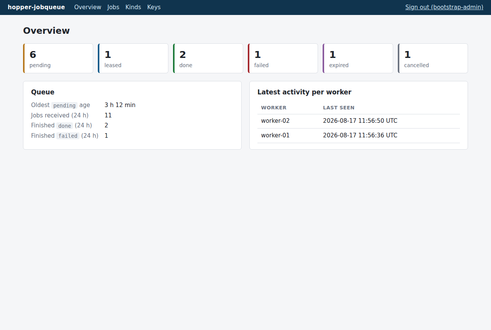
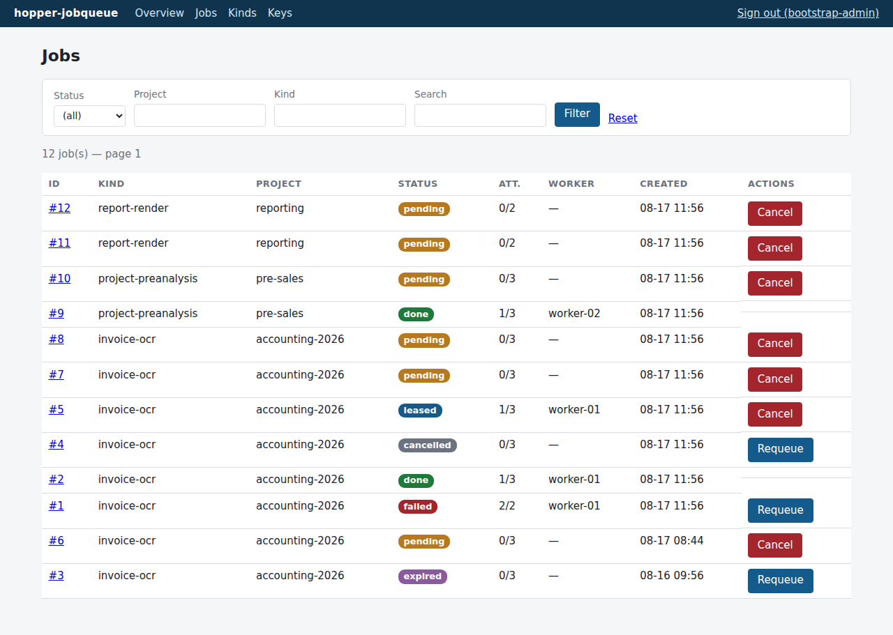
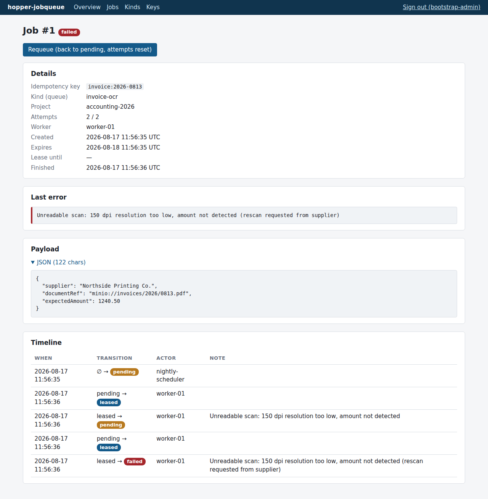

# hopper-jobqueue

**A small, self-contained HTTP job queue for workers behind NAT.**

Arbitrary producers — scripts, applications, webhooks, plain `curl` — drop jobs in.
Workers that can only make *outbound* HTTPS calls come and fetch them, with lease
semantics: a job that is claimed and never returned becomes available again on its own.
The service stores and distributes; it executes nothing and never calls anything
external. Producers poll their results back.

Documentation: **[etiennecoumont.github.io/hopper-jobqueue](https://etiennecoumont.github.io/hopper-jobqueue/)**
(also browsable in [`docs/`](docs/index.md)).

## Why "hopper"?

The name is a double pun.

|  |  |
|---|---|
| An **industrial hopper** takes bulk loads dumped in at the top and feeds them out of the bottom in a steady, measured stream. That is precisely this service: producers tip jobs in as they come; workers draw them out one at a time. | **Edward Hopper** painted lone figures waiting under artificial light in the middle of the night. Anyone who has watched a worker poll an empty queue at 3 a.m. knows the mood. |

*Both illustrations are original vector art drawn for this project and dedicated to the
public domain — no rights reserved.*

## Screenshots

The admin dashboard — server-rendered Razor Pages, one hand-written CSS file, no
front-end build:







More pages (keys, kinds, sign-in) in the
[operations guide](docs/operations.md).

## Features

- **Idempotent enqueue** — producers retry blindly; replaying a submission is a `200`,
  never an error. Enforced in the database, not with a racy pre-check.
- **Leases with heartbeat** — a claimed job returns to the queue by itself if the
  worker vanishes; a zombie worker can never overwrite the work of the one that took
  over (lease tokens, `409`).
- **Poison-message protection** — attempts are counted at claim time; a job that keeps
  killing its worker ends up `failed`, not looping forever.
- **Fair multi-queue scheduling** — oldest job of each eligible queue, then a random
  pick; a queue that receives 500 jobs at once cannot starve the others. Concurrent
  claims are safe (`for update skip locked`) and exact: no double delivery, no lying
  "empty" responses.
- **Scoped API keys** — `producer` / `worker` / `admin`, one key per client, each
  restricted to its allowed queues; SHA-256 at rest, constant-time comparison,
  targeted revocation.
- **Pausable queues** — pause distribution without touching producers; TTLs, per-queue
  defaults and retention-based purge.
- **Full audit trail** — every state transition journaled in the same transaction,
  visible as a timeline in the dashboard.
- **Built for the public internet** — body-size caps, two-tier rate limiting, neutral
  errors, no enumeration oracles, no CORS.
- **Tested against a real database** — the concurrency suite (20-way claim races,
  lease takeovers, fairness) runs on PostgreSQL 17 via Testcontainers.

## Requirements

**Run:**

- Docker with Docker Compose v2.24+
- Production: a [Traefik](https://traefik.io/) instance on a `traefik-public` Docker
  network (TLS termination and the `/admin` IP allowlist live there)

**Develop:**

- .NET SDK 10.0
- Docker (integration tests start a disposable PostgreSQL 17)

## Quickstart

```bash
git clone https://github.com/EtienneCoumont/hopper-jobqueue.git
cd hopper-jobqueue
docker network create traefik-public   # once
cp .env.example .env                   # set HOPPER_DB_PASSWORD
docker compose up -d                   # dev mode: port 8080 + hot reload
curl http://localhost:8080/healthz     # -> ok
```

First start writes a bootstrap **admin key** to the logs, once:

```bash
docker compose logs hopper | grep "bootstrap admin key"
```

Sign in at `http://localhost:8080/admin`, declare a kind, create real producer and
worker keys, revoke the bootstrap key. Then the whole life of a job is four calls:

```bash
H=http://localhost:8080/api/v1
curl -s $H/jobs -H "Authorization: Bearer $PRODUCER_KEY" -H 'Content-Type: application/json' \
  -d '{"idempotencyKey":"demo:1","kind":"invoice-ocr","payload":{"ref":"doc-123"}}'   # enqueue
curl -s $H/jobs/claim -H "Authorization: Bearer $WORKER_KEY" -H 'Content-Type: application/json' \
  -d '{"workerId":"w1"}'                                                              # claim -> leaseToken
curl -s $H/jobs/1/complete -H "Authorization: Bearer $WORKER_KEY" -H 'Content-Type: application/json' \
  -d '{"leaseToken":"…","outcome":"success","result":{"report":"ok"}}'                # complete
curl -s $H/jobs/by-key/demo:1 -H "Authorization: Bearer $PRODUCER_KEY"                # read back
```

Production deployment (no published port, Traefik in front):

```bash
docker compose -f compose.yaml up -d --build
```

## Documentation

| Page | Content |
|---|---|
| [Getting started](docs/getting-started.md) | Requirements, first run, first key, first job |
| [API reference](docs/api.md) | Every endpoint with `curl` examples, auth, errors, limits |
| [Architecture](docs/architecture.md) | Data model, state machine, lease and fairness mechanics |
| [Deployment](docs/deployment.md) | Docker, Traefik, environment variables, hardening |
| [Operations](docs/operations.md) | Dashboard tour, keys, monitoring, backup and restore |

The original design brief — every decision and its rationale, in French — is in
[`BRIEF.md`](BRIEF.md); [`CLAUDE.md`](CLAUDE.md) carries the working notes for AI
coding sessions.

## Development

```bash
dotnet build    # zero-warning policy (TreatWarningsAsErrors)
dotnet test     # 16 integration tests against a real PostgreSQL 17 (Docker required)
```

Stack: .NET 10 minimal API + Razor Pages, PostgreSQL 17, Npgsql + Dapper (explicit
SQL, no ORM), DbUp migrations, Serilog JSON logs, xUnit + Testcontainers.
