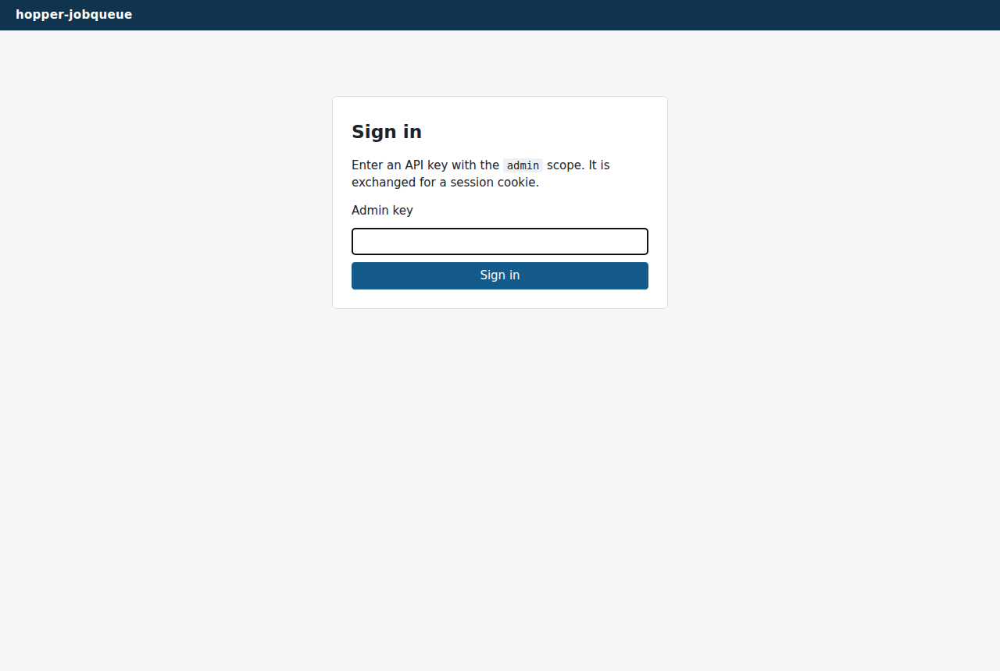

# Getting started

[← Back to index](index.md)

## Requirements

To **run** the service (production): Docker with Compose v2, and a
[Traefik](https://traefik.io/) instance for TLS termination (any TLS-terminating
reverse proxy works, but the shipped labels target Traefik). The image is prebuilt
by CI — nothing is compiled on the server.

To **develop**: .NET SDK 10.0, and Docker (the dev database runs in a container, and
the integration tests spin up a real PostgreSQL 17 via Testcontainers).

No outbound network access is required at runtime: the service never calls anything.

## First run (development)

The dev compose file starts PostgreSQL only; the API runs on your machine with hot
reload and a working debugger:

```bash
git clone https://github.com/EtienneCoumont/hopper-jobqueue.git
cd hopper-jobqueue
docker compose up -d      # PostgreSQL on localhost:5432, dev credentials
export HOPPER_DB_CONNECTIONSTRING="Host=127.0.0.1;Port=5432;Database=hopper;Username=hopper;Password=hopper-dev"
dotnet watch --project src/HopperJobQueue.Api run --urls http://localhost:8080
curl http://localhost:8080/healthz     # -> ok
```

Without the .NET SDK, the `try` profile runs the CI-published image instead:

```bash
docker compose --profile try up -d     # database + API on http://localhost:8080
```

Production works differently — a copied compose file pulling the GHCR image, no
checkout: see [Deployment](deployment.md).

## Bootstrap key

On first start, if the key table is empty, the service creates an `admin` key and
writes it **once** to the logs — straight to your console under `dotnet watch`, or:

```bash
docker compose logs hopper | grep "bootstrap admin key"   # try profile / production
```

Alternatively, set the `HOPPER_BOOTSTRAP_ADMIN_KEY` environment variable
(`hjq_admin_{32 base62 chars}`) before the first start.

Sign in at [http://localhost:8080/admin](http://localhost:8080/admin) with that key:



Then:

1. **Declare a kind** (`/admin/kinds`) — a kind is a queue plus its defaults (TTL, max
   attempts, lease duration, retention). Jobs can only be enqueued on declared kinds.
2. **Create real keys** (`/admin/keys`) — one `producer` key per producer, one `worker`
   key per worker, each restricted to its allowed kinds. The clear-text key is shown
   exactly once.
3. **Revoke the bootstrap key** — it went through the container logs.

Use `localhost`, not a bare IP: the session cookie is `Secure`, which browsers accept
on `localhost` only.

## First job, end to end

```bash
H=http://localhost:8080/api/v1

# 1. the producer enqueues (idempotent: replaying the same key is a 200, not an error)
JOB=$(curl -s $H/jobs -H "Authorization: Bearer $PRODUCER_KEY" -H 'Content-Type: application/json' \
  -d '{"idempotencyKey":"demo:1","kind":"invoice-ocr","payload":{"ref":"doc-123"}}')
ID=$(echo $JOB | jq -r .id)

# 2. the worker claims (from anywhere — only outbound HTTPS needed)
CLAIM=$(curl -s $H/jobs/claim -H "Authorization: Bearer $WORKER_KEY" -H 'Content-Type: application/json' \
  -d '{"workerId":"w1","leaseSeconds":1200}')
TOKEN=$(echo $CLAIM | jq -r .leaseToken)

# 3. while working, it extends the lease
curl -s $H/jobs/$ID/heartbeat -H "Authorization: Bearer $WORKER_KEY" -H 'Content-Type: application/json' \
  -d '{"leaseToken":"'$TOKEN'"}'

# 4. it returns the result
curl -s $H/jobs/$ID/complete -H "Authorization: Bearer $WORKER_KEY" -H 'Content-Type: application/json' \
  -d '{"leaseToken":"'$TOKEN'","outcome":"success","result":{"report":"ok"}}'

# 5. the producer reads it back whenever it wants
curl -s $H/jobs/by-key/demo:1 -H "Authorization: Bearer $PRODUCER_KEY"
```

A typical worker is a loop: `claim` → work (+ `heartbeat`) → `complete` → sleep 30 s
when the queue answers `204`.

## Running the tests

```bash
dotnet test
```

Docker is required: the suite starts a real PostgreSQL 17 (Testcontainers) and runs the
whole application against it — including 20-way concurrent claim races, lease-expiry
takeovers and fairness across queues.

Next: the [API reference](api.md).
