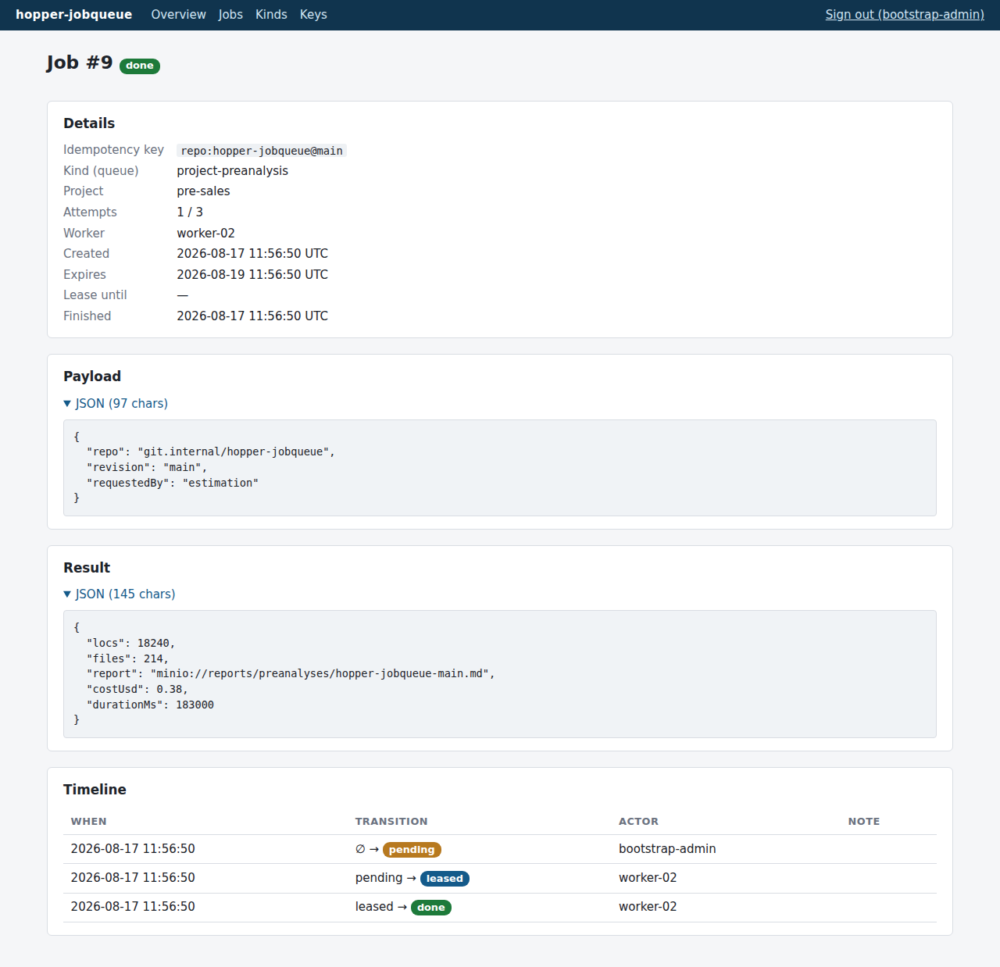
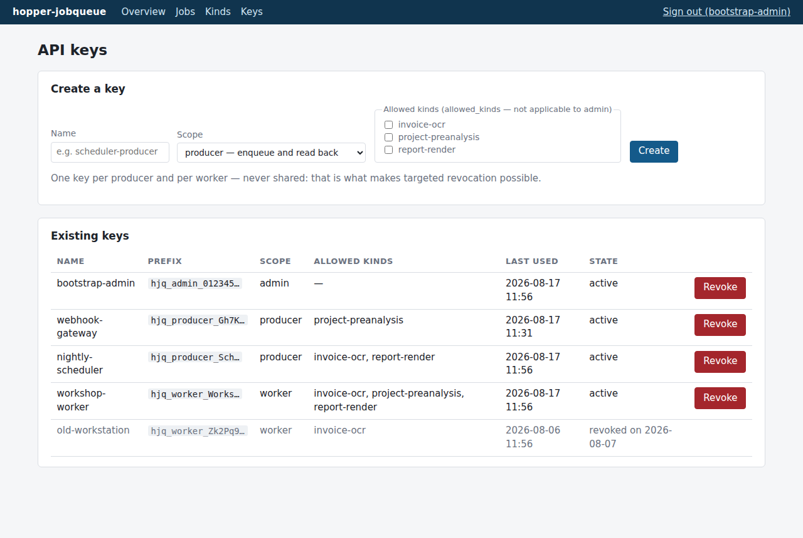
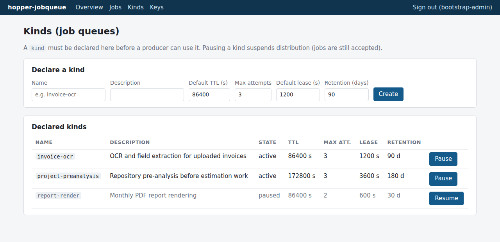

# Operations

[← Back to index](index.md)

## The dashboard

Server-rendered Razor Pages under `/admin`, behind the proxy's IP allowlist plus an
admin-key sign-in exchanged for a session cookie (`HttpOnly`, `Secure`,
`SameSite=Strict`).

### Overview — "is it running?"


Counters per status, the age of the oldest `pending` job, 24 h throughput and the last
time each worker was seen. The page refreshes itself every 30 seconds.

**The one metric to watch is the oldest `pending` age.** The target volume is a few
dozen jobs a day, so throughput graphs say nothing; but if that age climbs, the worker
is dead or saturated. It is also exposed by `GET /api/v1/stats` for external
monitoring.

### Jobs — list and detail


Filters on status, project, kind and free text; inline **Requeue** / **Cancel** actions
appear only where the transition is legal (requeue from `failed`/`expired`/`cancelled`,
never from `done`; cancel from `pending`/`leased`).


The detail page shows the full last error, the payload and result as folded JSON, and
the complete audit timeline — every transition with its timestamp, actor and note, as
written by the API in the same transaction as the state change. A successful job shows
its result the same way:



### Keys



Create and revoke API keys. The clear-text key is displayed exactly once, at creation —
only the SHA-256 hash is stored. One key per producer and per worker, never shared:
that is what makes targeted revocation painless. Revocation takes effect immediately on
the API and invalidates dashboard sessions on their next request.

### Kinds



Declare queues and their defaults (TTL, max attempts, lease duration, retention).
**Pause** stops distribution while still accepting enqueues — producers never notice;
jobs accumulate and flow again on **Resume**.

## Job lifecycle operations

- **A job failed for good** (`failed`): read `lastError` and the timeline, fix the
  cause, then **Requeue** — attempts reset to zero and the TTL is extended.
- **A job must not run** (`pending`/`leased`): **Cancel**. A worker still holding the
  lease gets `409` on its next heartbeat or complete and abandons.
- **Purge**: terminal jobs are deleted automatically after their kind's
  `retention_days` (default 90) by the sweeper.

## Logs

Serilog writes JSON to stdout — one line per event, aggregation-friendly:

```bash
docker compose logs -f hopper    # from the deployment directory
```

Authentication failures are logged at `Information` with source IP and attempted key
prefix. The only clear-text key that ever reaches the logs is the bootstrap admin key,
once, at first start — revoke it after setup.

## Backup and restore

Daily compressed `pg_dump` (custom format) with rolling retention — 7 daily, 4 weekly.
The scripts live in the deployment directory next to `compose.yaml` and `.env`
(copied from the repo's `deploy/maintenance/` at install time) and change to their own
directory themselves, so a cron entry is a plain absolute path. They only reference the
`hopper` and `hopper-db` service names, so they work with either deployment variant:

```cron
0 3 * * *  /opt/hopper-jobqueue/backup.sh /var/backups/hopper-jobqueue >> /var/log/hopper-backup.log 2>&1
```

Each backup is verified readable (`pg_restore --list`) before rotation. Restore:

```bash
/opt/hopper-jobqueue/restore.sh /var/backups/hopper-jobqueue/daily/hopper_YYYYMMDD_HHMMSS.dump
```

The script stops the API (no connections during the operation), recreates the `hopper`
database from the dump (`pg_restore --create --clean`), and restarts the API — DbUp
revalidates the schema at startup. Check `/readyz` and the dashboard afterwards.

The procedure was executed for real during setup — volume destroyed, then jobs, events
and keys restored identically. A backup that was never restored is not a backup: redo
the drill after any PostgreSQL major-version change.
